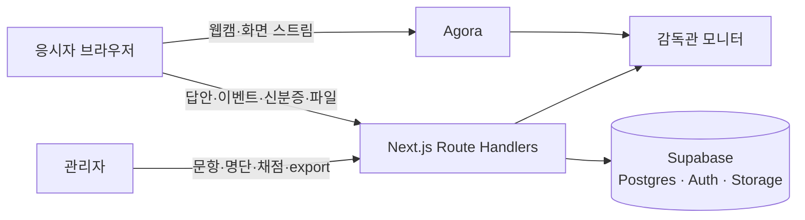

# kbrain-cert

작업형 문항 전용 온라인 CBT 플랫폼. 응시자 화상·화면 실시간 감독, 감독관 모니터, 이상 행동 이벤트 로그, 슬롯별 수동 채점, 답안 일괄 export까지 시험 운영 한 사이클을 담당한다.

> **소스는 회사 자산이라 비공개입니다.** 이 저장소는 무엇을 · 왜 · 어떻게 만들었는지 기록한 사례 문서입니다. 코드는 면접 등에서 화면 공유로 설명할 수 있습니다.

## 왜 만들었나

기존 AI 챔피언 인증평가는 Lovable로 생성된 외부 코드 위에서 운영했고, 실제 시험에서 같은 문제가 반복됐다. 기능 방향만 가져오고 Next.js로 새로 만들었다.

| 원본에서 반복된 문제 | 이 시스템의 처리 |
|---|---|
| 생성형 AI 작업형 문항에서 감독 오탐 | 문제 세트 단위 감독 ON/OFF 플래그 |
| 응시자 화면에 정답 필드 노출 | 자동채점 자체를 없앴다. 채점 기준(rubric)은 서버에만 존재 |
| 원점수와 100점 환산 표시 혼용 | 단일 헬퍼로 전역 강제, 저장은 raw |
| 타이머 시작 시각 누락 시 즉시 자동제출 | 서버 시간 재동기화 3회 재시도 후 자동제출 |

## 무엇이 들어 있나

| 역할 | 기능 |
|---|---|
| 관리자 | 시험·문항 세트·응시자 명단 업로드·초대·채점·결과 및 답안 zip export |
| 감독관 | 실시간 모니터(세트별 답안 진행률, 응시자 검색), 이상 이벤트 로그, 세션 상세 |
| 응시자 | 공용 링크 + 이름 + 전화 뒷 4자리로 입장 → 신분증 업로드 → 대기실 → 응시 → 완료 |

## 아키텍처

응시자는 Supabase Auth 사용자가 아니다. 명단 매칭 후 HMAC 서명 쿠키로 세션을 유지하고, 응시자용 API는 모두 쿠키의 세션 ID와 요청 본문의 세션 ID가 일치할 때만 응답한다.
타이머는 세 겹으로 지킨다. 클라이언트가 탭 전환·복귀 때 절대 시각으로 재계산하고, pg_cron이 매분 만료 세션을 자동 제출하며, 시험 시작 시각은 모든 응시자가 공유하는 절대 시각이다.

## 규모·설계 기준

- 누적 응시 1,466명 (동일인 중복 제거 시 1,376명), 최대 동시 응시 108명 (운영 집계)
- 설계 기준은 동시 100명 · 120분 · 회당이었고, 실제 운영에서 108명을 넘겼다
- 문제 유형은 작업형(슬롯 조합: text · long_text · url · file · number) 한 종류. 자동채점 없음
- 본인 확인은 신분증 이미지 업로드 후 관리자 사후 검토
- 응시 녹화 저장(Cloudflare R2)과 부하 테스트는 계획 단계 (MASTER_PLAN M4·M6)

## 스택

Next.js 16 (App Router) · React 19 · TypeScript · Tailwind v4 · shadcn/ui · Supabase (Postgres · Auth · Storage · pg_cron) · Agora Web SDK · Vercel

## 문서

- [DECISIONS.md](docs/DECISIONS.md) — 설계 결정 8개와 근거
- [ARCHITECTURE.md](docs/ARCHITECTURE.md) — 스택 · 데이터 모델 · 외부 통합
- [CAPACITY.md](docs/CAPACITY.md) — 동시 응시 부하 계획 (비용 · 병목 · 부하검증)
- [FEATURES.md](docs/FEATURES.md) — 역할별 기능
