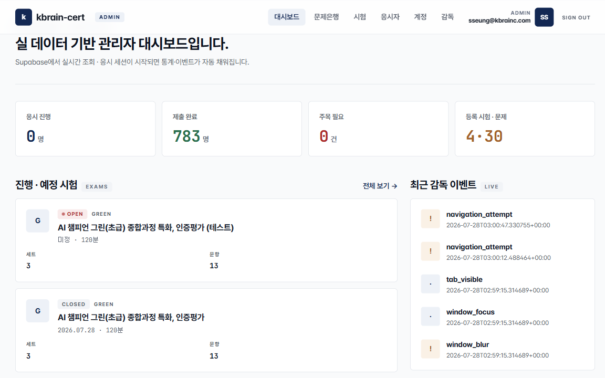
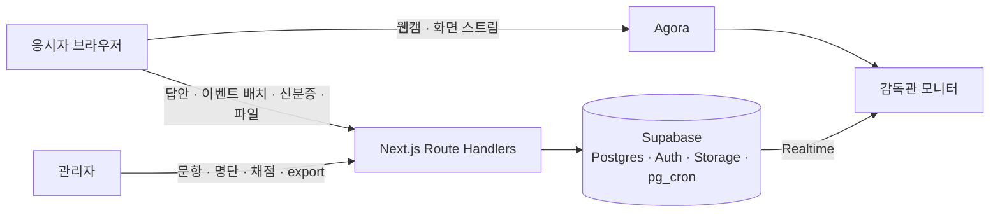

# 인증평가 CBT — 사례

AI 챔피언 인증평가(행안부 · NIA)용 온라인 CBT. 문항 관리 · 응시자 입장 · 실시간 화상 감독 · 감독관 모니터 · 수동 채점 · 답안 일괄 export까지 시험 운영 한 사이클을 담당한다. 2026년 7월부터 실시험에 사용.

사내 코드네임은 `kbrain-cert`. AI 챔피언 인증평가에 쓰는 사내 시험 시스템이다.

> **소스는 회사 자산이라 비공개입니다.** 이 저장소는 무엇을 · 왜 · 어떻게 만들었는지 기록한 사례 문서이며, 실행 가능한 코드는 포함하지 않습니다. 코드는 면접 등에서 화면 공유로 설명할 수 있습니다.

## 배경과 문제

기존 인증평가는 외부 도구로 생성된 코드 위에서 운영했다. 실제 시험을 여러 회 치르면서 같은 문제가 반복됐다.

| 반복된 문제 | 왜 생겼나 |
|---|---|
| 생성형 AI 작업형 문항에서 감독 오탐 | 응시자가 다른 창에서 AI 도구를 써야 하는 문항인데 감독 장치가 "탭 이탈"로 잡았다 |
| 응시자 화면에 정답 필드 노출 | API가 문항 전체를 내려보낸 뒤 클라이언트에서 가리는 구조였다 |
| 원점수와 100점 환산 표시 혼용 | 화면마다 계산이 달랐다 |
| 타이머 시작 시각 누락 시 즉시 자동 제출 | 예외 처리 하나로 응시가 날아갔다 |

원본을 고치는 대신 기능 방향만 가져와 새로 만들었다. 위 네 가지는 설계 단계에서 구조적으로 없앴다.

## 요구사항

1. 응시자는 계정 없이 공용 링크 + 이름 + 전화 뒷자리로 입장한다.
2. 문항은 작업형 한 종류. 슬롯(텍스트 · 긴 글 · URL · 파일 · 숫자) 조합이고 자동채점은 없다.
3. 감독관은 응시자 웹캠 · 화면을 실시간으로 보고, 이상 이벤트를 받고, 시간 연장과 강제 종료를 할 수 있다.
4. 채점 기준(rubric)은 응시자에게 절대 도달하지 않는다.
5. 동시 응시 100명 · 120분을 설계 기준으로 한다.
6. 답안은 시험 단위 zip으로 내보내 외부 채점자에게 넘긴다.

## 설계 결정

| 결정 | 요약 |
|---|---|
| 자동채점을 없앴다 | 모든 문항이 작업형이라 정답 자체가 없다. 정답 노출 문제가 구조적으로 사라졌다 |
| 응시자 전용 뷰 | 채점 기준을 뺀 DB 뷰만 응시자 경로가 읽는다. 서버 컴포넌트가 페치하므로 클라이언트 payload에 rubric이 존재하지 않는다 |
| 세트 단위 감독 스위치 | 문제 세트마다 감독 장치를 끌 수 있다. 끄면 이벤트 수집을 멈추되 화상 스트림은 유지한다 |
| 타이머 3중 방어 | 클라이언트는 탭 복귀 시 절대 시각으로 재계산, 서버 pg_cron이 매분 만료 세션을 자동 제출, 시험 시작 시각은 전원 공통 |
| 응시자는 인증 사용자가 아니다 | 명단 매칭 후 HMAC 서명 무상태 쿠키(6시간). 응시자용 API는 쿠키의 세션 ID와 요청 본문의 세션 ID가 같을 때만 응답 |
| 감독관 채팅은 Supabase Realtime | 화상 SDK의 메시징 대신 자체 테이블 + Realtime. 감독 이벤트 로그와 채팅을 분리 |
| 답안은 zip 하나 | 응시자별 폴더, 문항 × 슬롯별 파일, 요약 CSV, 상태 요약 md. 자동 제출자는 표시만 하고 격리하지 않는다 |
| 실습과 실시험은 같은 컴포넌트 | 4단계 위저드(환경 체크 → 서약 → 대기실 → 시험창)를 공용으로 쓰고, 세션 ID 유무로 서버 저장 여부를 가른다 |

각 결정의 상황 · 이유 · 트레이드오프는 [docs/decisions.md](docs/decisions.md).

## 아키텍처

구성 요소, 인증 두 갈래, 저장소 버킷, 용량 계획은 [docs/architecture.md](docs/architecture.md).

## 결과 · 규모

운영 집계, 실시험 기준(부하 테스트 아님).

| 항목 | 값 |
|---|---|
| 최대 동시 응시 | 108명 (설계 기준 100명) |
| 누적 응시 | 1,466명 |
| 고유 응시자 | 1,376명 |
| 등록 시험 · 문제 세트 | 4회차 · 30세트 (2026-07 대시보드) |
| 코드 규모 | 커밋 215개 (2026.07 ~ 2026.08) |

## 배운 것과 남은 과제

- **문제를 없애는 설계가 막는 설계보다 싸다.** 정답 노출은 "가리기"가 아니라 "정답이 없는 문항 구조"로 풀렸다.
- **타이머는 클라이언트를 믿으면 안 된다.** 백그라운드 탭에서 setInterval이 1분에 1회로 느려지는 것을 실제로 겪었다.
- **실기기 리허설이 필수다.** WebRTC는 자동화 테스트가 안 된다. 감독 스트림 · 인코딩 · 화면 공유를 동시에 켠 저사양 노트북에서 프레임이 떨어졌다.
- **남은 과제.** 응시 녹화 저장(스키마만 있고 미구현), 부하 테스트 자동화, E2E 테스트. 2026년 하반기 항목.

## 스택

Next.js 16 (App Router) · React 19 · TypeScript · Tailwind v4 · shadcn/ui · Supabase (Postgres · Auth · Storage · Realtime · pg_cron) · Agora Web SDK · Vercel
