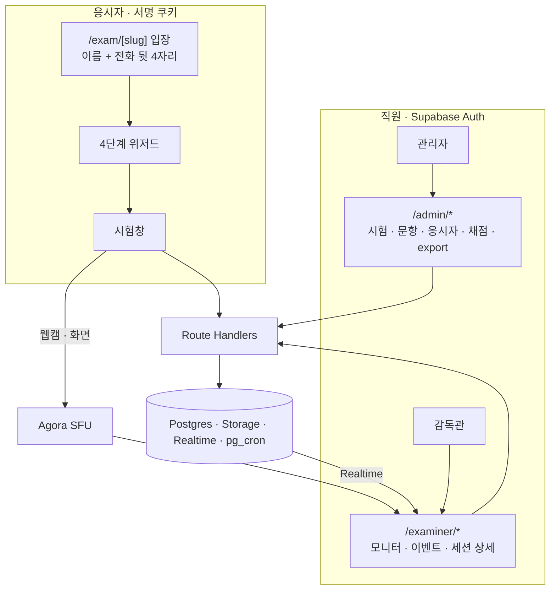

# 아키텍처

## 구성

```
app/              Next.js 16 App Router — 관리자 · 감독관 · 응시자 라우트와 API
components/       응시 위저드, 감독 장치, 감독관 모니터, Agora 퍼블리셔
lib/              인증 두 갈래, 세션 쿠키, 채점 헬퍼, Supabase 클라이언트
supabase/         마이그레이션 (SQL Editor에 수동 적용)
docs/             설계 · 용량 · 기능 문서
```

Next.js 16 App Router, React 19, Tailwind v4, TypeScript strict. 미들웨어는 Next.js 16 규약대로 `proxy.ts`이며 인증 쿠키 갱신만 담당한다.

## 세 가지 사용자, 두 가지 인증



| 구분 | 인증 | 권한 판정 |
|---|---|---|
| 관리자 · 감독관 · 채점자 | Supabase Auth (이메일 · 비밀번호) | 역할 테이블 조회. 서버 컴포넌트에서 `requireRole` |
| 응시자 | 명단 매칭 → HMAC 서명 쿠키 (6시간, HttpOnly) | 응시자용 API마다 쿠키 세션 ID = 본문 세션 ID 검사 |

Supabase 클라이언트는 두 종류다. 사용자 쿠키를 읽어 RLS를 적용하는 것과, 서버 전용 키로 RLS를 우회하는 것. 응시자 흐름은 인증 사용자가 아니므로 후자를 쓰되 세션 쿠키 검사가 앞에 선다.

## 데이터 격리

- `questions` 테이블은 직원만 읽는다.
- 응시자는 채점 기준 컬럼을 제외한 `questions_for_applicant` 뷰만 읽는다.
- 응시 페이지는 서버 컴포넌트가 뷰를 페치한다. 클라이언트 번들과 payload에 채점 기준이 존재하지 않는다.

## 저장소 버킷

세 개의 private 버킷을 각각 인증을 강제하는 Route Handler로 서빙한다.

| 버킷 | 내용 | 접근 |
|---|---|---|
| exam-attachments | 시험 첨부 | 직원 · 실습 슬러그 · 응시자 세션(해당 시험만) |
| answer-files | 응시자 답안 파일 | 직원 · 응시자 세션(경로의 세션 ID 일치) |
| identity-documents | 신분증 이미지 | 관리자 · 감독관만 |

## 감독 파이프라인

```
응시자 브라우저
  ├─ 얼굴 감지 (브라우저 로컬 추론, 2.5초 간격)
  ├─ 전체화면 가드 + 탭 가시성
  ├─ Agora 퍼블리셔 (웹캠 · 화면 공유 송출)
  └─ 이벤트 배처 (5초 창) ──→ POST 이벤트 bulk ──→ monitoring_events ──→ Realtime ──→ 감독관 모니터
```

- 세트 단위 감독 비활성 플래그가 켜지면 감지 · 가드 · 배처가 내려가고 Agora 송출은 유지된다.
- 감독관 모니터는 세트별 답안 진행률, 응시자 검색, 이벤트 발생 응시자 자동 상위 노출(주목 · 경고 · 정상 3단), 시간 연장 · 강제 종료, 채팅(Supabase Realtime)을 제공한다.

## 시간

- 시험 시작 시각은 시험 단위 절대 시각. 종료 = 시작 + 소요 시간 + 세션별 연장.
- 클라이언트는 대기실에서 서버 시각 오프셋을 잡고, 탭 복귀 · 포커스 · 온라인 이벤트에서 재계산한다.
- pg_cron이 매분 만료 세션을 자동 제출한다(`auto_submitted=true`). 감독관 강제 종료는 `auto_submitted=false` + 사유 메모.

## 용량 설계 (동시 100명 · 120분)

| 병목 | 대응 |
|---|---|
| 시험 시작 순간 문항 페치 폭주 | 문항 payload 캐시 (응시자 공용) |
| 답안 저장 지속 write | 디바운스 + upsert, 커넥션 풀링 |
| 감독 이벤트 초당 수백 건 | 클라이언트 5초 배치 → bulk insert |
| 화상 스트림 100개 | SFU, 듀얼 스트림. 감독관은 저해상도 수신, 확대 시만 고해상도 |
| 종료 시각 제출 폭주 | 세션 ID 기준 멱등 처리 |

실측 최대 동시 108명. 자동화 부하 테스트는 WebRTC 때문에 불가능해 실기기 리허설로 대신했다.

## 운영

- 배포 Vercel, DB · Storage · Realtime Supabase, 화상 Agora.
- 마이그레이션은 SQL 파일로 기록하고 수동 적용. 타입 정의는 손으로 유지하며 파일 머리에 반영된 마이그레이션 목록을 적는다.
- 테스트 러너는 아직 없다. 검증은 UI 수동 확인.
